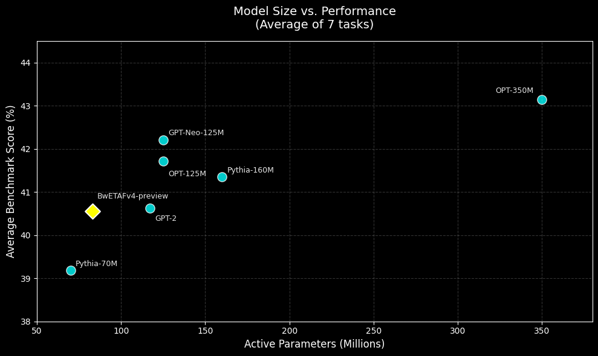

# BwETAFv4-preview

BwETAFv4-preview is the next iteration of the BwETAF series, moving directly from the dense architectures of v3 into a sparse Mixture-of-Experts (MoE) design.

The core goal of this version is decoupling total model capacity from active compute cost. While the model holds 250 million total parameters to retain a wider knowledge base, it uses a top-2 gating mechanism across 8 total experts (a 2A8E configuration). This means that for any single token, the router only activates 2 experts, keeping the active footprint at just 83 million parameters during inference.

This release is a preview checkpoint trained on 10 billion tokens to benchmark the stability, routing balance, and downstream performance of the new MoE stack.

---

## Model Statistics

| Field | Value |
|---|---|
| Architecture | Sparse Mixture-of-Experts Transformer |
| Total Parameters | 251M |
| Active Parameters | 83M |
| Expert Configuration | 2 Active / 8 Experts (2A8E) |
| Attention Dimension | 768 |
| Feed Forward Dimension | 1536 |
| Transformer Blocks | 8 |
| Attention Heads | 8 |
| GQA Repeats | 2 |
| Vocabulary Size | 16,384 |
| Maximum Context Length | 8,192 |
| Training Tokens | 10B |
| Training Hardware | TPUv5e |
| Total Compute | ~156 TPUv5e chip-hours |
| Precision | Mixed precision |
| Framework | JAX / Flax |

---

## Training Configuration

| Setting | Value |
|---|---|
| Optimizer | AdamW |
| Learning Rate Schedule | Cosine Decay |
| Normalization | RMSNorm |
| Dropout | 0.03 |
| Learning rate | 7e-4 |

---

## Performance vs Model Size

The figure below compares BwETAFv4 Preview against several open-source language models of varying sizes. Scores represent the average performance across seven evaluation tasks.



---

## Model Comparisons (0-shot)


| Model | PIQA | BoolQ | WinoGrande | ARC-Easy | HellaSwag | ARC-Challenge | MMLU | Average | Training Tokens |
|-------|------|-------|------------|----------|-----------|---------------|------|---------|----------------|
| OPT-350M | 64.42% | 57.68% | 52.17% | 40.07% | 40.82% | 23.72% | 23.10% | 43.14% | 180B |
| GPT-Neo-125M | 62.30% | 61.71% | 50.51% | 39.39% | 35.40% | 23.04% | 23.10% | 42.21% | 300B |
| OPT-125M | 61.97% | 56.18% | 51.62% | 40.03% | 36.94% | 22.44% | 22.86% | 41.72% | 180B |
| Pythia-160M | 61.53% | 55.02% | 51.07% | 39.90% | 35.25% | 23.72% | 22.99% | 41.35% | ~300B |
| GPT-2-124M | 62.68% | 48.47% | 51.93% | 39.60% | 36.21% | 22.61% | 22.93% | 40.63% | ~9B |
| **BwETAFv4-preview** | 56.09% | 59.85% | 50.67% | 36.66% | 34.84% | 22.78% | 22.96% | 40.55% | **10B** |
| Pythia-70M | 58.65% | 51.99% | 51.85% | 34.68% | 32.03% | 22.10% | 22.95% | 39.18% | ~300B |

**Notes:**
- All scores are percentages. For PIQA, ARC-Easy, HellaSwag, ARC-Challenge: `acc_norm`; for BoolQ, WinoGrande, MMLU: raw `acc`.
- Training token estimates: GPT-2 (reproduced WebText) ~9B; Pythia models trained on 300B tokens (The Pile); OPT models trained on 180B tokens.

---

## Training Data

BwETAFv4-preview was trained on approximately 10.06 billion tokens
from a mixture of web, educational, encyclopedic, and mathematical text.

| Dataset | Tokens | Share |
|----------|---------:|------:|
| FineWeb | 7.7B | 76.56% |
| Wikipedia | 671M | 6.67% |
| FineWeb-Edu | 1B | 10.29% |
| FineMath | 651M | 6.48% |
| **Total** | **10B** | **100%** |

---

## Tokenizer & Padding

- **Vocabulary size**: 16,384
- **Special token**: `<eos>` (end‑of‑sequence) has ID `0`. No `<bos>` token is required for generation.
- **Implementation**: Uses the Hugging Face `tokenizers` library internally, but is bundled within the `BwETAF` library for convenience.
- **Training data**: The tokenizer was trained on the **FineWeb** dataset.
- **Padding support**: Both pre‑padding (left) and post‑padding (right) are supported. However, for optimal MoE routing, **left‑padding (pre‑padding)** is recommended.
- **Performance note**: The tokenizer was not trained on code or mathematical formatting (e.g., LaTeX). It may struggle with structured math, equations, or programming syntax.

The tokenizer is loaded from the local `Loaded_model` directory:

```python
from BwETAF.tokenizer.main import load as load_tokenizer
tokenizer = load_tokenizer("Loaded_model")
```

---

## Usage

### Prerequisites

* Install the `BwETAF` library (custom MoE inference framework).
* Download the model locally before using KV-cached inference.

### Configuration Notes

Several advanced parameters can be adjusted depending on your hardware and use case:

* **attn_chunks**: Controls the number of chunks used during Flash Attention computation. Increasing this value can reduce memory usage for longer sequences at the cost of additional computation.

* **capacity**: Controls expert capacity within the Mixture-of-Experts (MoE) architecture. Higher values may reduce expert overflow but increase memory and compute requirements.

* **theta**: Controls RoPE extrapolation for extending context lengths beyond the training context. Increasing this value may allow longer contexts, but can significantly degrade model performance if the model has not been fine-tuned for the extended context length.


```bash
pip install BwETAF==0.7.3
```
### Loading and Inference Example

```python
import jax
import BwETAF
from BwETAF.tokenizer.main import load as load_tokenizer
from BwETAF.api.predictv4 import KV_caching

# ------------------------------
# 1. Load the model
# ------------------------------
# - mesh=(data_parallel, model_parallel) – here (1,1) means single device
# - dtype=bfloat16 for efficient inference
model = BwETAF.load_hf(
    "WICKED4950/BwETAFv4-preview",
    mesh=(1, 1),
    dtype=jax.numpy.bfloat16
)

# ------------------------------
# 2. Load the tokenizer
# ------------------------------
tokenizer = load_tokenizer("Loaded_model")

# ------------------------------
# 3. Set up KV‑cached generation
# ------------------------------
generator = KV_caching(
    model="Loaded_model",              # local model directory
    mesh=(1, 1),                       # same mesh as above
    max_len=64,                        # total output length (incl. input)
    prompt_max_len=0,                  # 0 means no separate prompt truncation
    seed=0,                            # random seed for reproducibility
    top_k=20,                          # top‑k sampling
    top_p=0.85,                        # nucleus sampling
    temperature=1.2                    # sampling temperature
)

# ------------------------------
# 4. Generate text
# ------------------------------
prompts = [
    "In the current era, LLMs are basically",
]

outputs = generator(prompts)
print(outputs)
```

---

## Limitations

BwETAFv4-preview is a small-scale language model and has several limitations:

* As an 83M parameter model, it may produce inaccurate, misleading, or fabricated information more frequently than larger language models.
* The model has not undergone instruction tuning and may not reliably follow complex instructions or conversational formats.
* Performance may vary significantly depending on prompt wording and task domain.
* The model has only been evaluated on the benchmarks reported in this document and may exhibit different behaviour on real-world tasks.
* The model has not undergone alignment or safety-specific fine-tuning.

---

## Citation

If you use BwETAFv4-preview in your work, please cite:

```bibtex
@misc{bwetafv4preview2025,
  title        = {BwETAFv4-preview},
  author       = {Boring._.wicked},
  year         = {2025},
  note         = {250M total / 83M active parameter autoregressive Mixture-of-Experts language model},
  url          = {https://huggingface.co/WICKED4950/BwETAFv4-preview}
}
```
